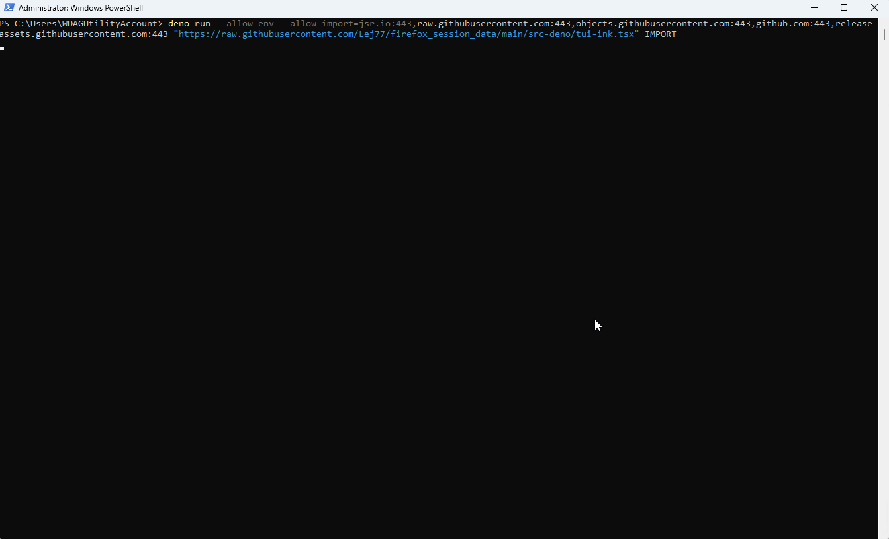

# Firefox Session Data CLI
<!-- markdownlint-disable MD013 -->

<!-- Badge style inspired by https://github.com/dnaka91/advent-of-code/blob/de37024ba3b385694e14f79c849370c0f605f054/README.md -->

<!-- [![Build Status][build-img]][build-url] -->
[![Documentation][doc-img]][doc-url]

<!--
[build-img]: https://img.shields.io/github/actions/workflow/status/Lej77/firefox_session_data/ci.yml?branch=main&style=for-the-badge
[build-url]: https://github.com/Lej77/firefox_session_data/actions/workflows/ci.yml
 -->
<!-- https://shields.io/badges/static-badge -->
[doc-img]: https://img.shields.io/badge/docs.rs-firefox_session_data-4d76ae?style=for-the-badge
[doc-url]: https://lej77.github.io/firefox_session_data

This repository contains a CLI tool for interacting with Firefox's session data which stores information about the browser's currently open windows and tabs.

## Platform support

Currently only Windows and WebAssembly are tested, but it should be easy to port to other platforms and seems to already compile without issues.

The most likely issue on other platforms is the code related to finding where Firefox stores its profile folders since currently that has only been implemented for Windows.

The optional HTML to PDF converters would probably require a bit of work in order to allow them to compile on all platforms, the code can be found at [Lej77/html_to_pdf: Rust code for different HTML to PDF conversion methods](https://github.com/Lej77/html_to_pdf). These aren't enabled by default though so they can be left alone for now.

## Graphical User Interface

There is a couple of GUI applications that provides some of the functionality that the CLI exposes:

- <https://github.com/Lej77/firefox-session-ui> ([Web demo](https://lej77.github.io/firefox-session-ui/)) (Built with web technology using the [`Dioxus`](https://crates.io/crates/dioxus) and [`Tauri`](https://crates.io/crates/tauri) frameworks)
- <https://github.com/Lej77/firefox-session-ui-gtk4> (Built using the [`GTK4`](https://crates.io/crates/gtk4) UI library)
- <https://github.com/Lej77/firefox-session-ui-iced> ([Web demo](https://lej77.github.io/firefox-session-ui-iced/)) (Built using the [`iced`](https://crates.io/crates/iced) UI library)
- <https://github.com/Lej77/firefox-session-ui-egui> ([Web demo](https://lej77.github.io/firefox-session-ui-egui/)) (Built using the [`egui`](https://crates.io/crates/egui) UI library)

I wrote some thoughts about my experience with the different UI libraries on reddit:\
<https://www.reddit.com/r/rust/comments/1mkfxwi/comment/n7j11up/>.

### Terminal User Interface



This repository also contains a [TUI](https://en.wikipedia.org/wiki/Text-based_user_interface) implemented using the [`ink`](https://github.com/vadimdemedes/ink) library that can be used with the [`deno`](https://deno.com/) JavaScript runtime. Using deno allows the TUI program to be sanboxed so that it only gets access to the exact file paths that it needs and nothing else. Compared to a web site which is also sandboxed the Deno TUI has a couple of advantages but also some disadvantages:

- Pro: It has no access to the internet by default and so can't send your data to a server somewhere.
  - This is something that is hard to guarantee when you upload files to random web sites on the internet.
- Pro: it can easily be given or request access to specific local files.
  - This allows the TUI to easily find your Firefox profile for you while for the web site this becomes a tedious manual step.
- Con: the UI is a lot more basic than what a normal web site offers.

The TUI program can be executed without manually downloading anything by running the following command (provided that Deno has already been installed):

```bash
deno run --allow-env --allow-import=jsr.io:443,raw.githubusercontent.com:443,objects.githubusercontent.com:443,github.com:443,release-assets.githubusercontent.com:443 "https://raw.githubusercontent.com/Lej77/firefox_session_data/refs/tags/v0.1.2/src-deno/tui-ink.tsx" IMPORT
```

(Instead of `IMPORT` one could specify a local path where the WebAssembly module
is located. In that case the `--allow-import` option is no longer necessary and can be skipped.)

## Usage

[Download precompiled executables from GitHub releases ⬇️](https://github.com/Lej77/firefox_session_data/releases)

To build from source you can clone the repo and compile using [`Cargo`](https://www.rust-lang.org/tools/install):

```bash
cargo run --release -- --help
cargo run --release -- tabs-to-links --firefox-profile=default-release --output=./my-links
```

You can use `cargo install` to easily build from source without manually cloning the repo:

```bash
cargo install --git https://github.com/Lej77/firefox_session_data.git
```

You can use [`cargo-binstall`](https://github.com/cargo-bins/cargo-binstall) to easily download the precompiled executables from a GitHub release:

```bash
cargo binstall --git https://github.com/Lej77/firefox_session_data.git firefox_session_data
```

### WebAssembly

This crate can be compile to WebAssembly and executed with nearly full functionality. You need a runtime like [`wasmtime`](https://crates.io/crates/wasmtime-cli) (`cargo install wasmtime-cli`) or [`deno`](https://deno.com/) to run WebAssembly.

#### Compile Rust to WebAssembly using `cargo-wasi`

We can use [`cargo-wasi`](https://crates.io/crates/cargo-wasi) (`cargo install cargo-wasi`) to easily compile and run the program:

```cmd
cargo wasi run -- tabs-to-links --compressed --stdin --stdout --format=text >.temp.txt <"%AppData%/Mozilla/Firefox/Profiles/XXXXXXXX.default-release/sessionstore-backups/recovery.jsonlz4"
```

Note: `XXXXXXXX` in the command is some unique prefix generated for your Firefox profile.

#### Compile Rust to WebAssembly manually

We can also manually compile the program for WebAssembly:

```bash
rustup target add wasm32-wasip1
cargo build --release --target wasm32-wasip1
```

The WebAssembly file should now be at `./target/wasm32-wasip1/release/firefox-session-data.wasm`.

#### Execute WebAssembly using `wasmtime`

After we have compiled or downloaded the `wasm` file we can run it using the `wasmtime` runtime:

```cmd
wasmtime "./target/wasm32-wasip1/release/firefox-session-data.wasm" tabs-to-links --compressed --stdin --stdout --format=text >.temp.txt <"%AppData%/Mozilla/Firefox/Profiles/XXXXXXXX.default-release/sessionstore-backups/recovery.jsonlz4"
```

Note: `XXXXXXXX` in the command is some unique prefix generated for your Firefox profile.

If we "preopen" the Firefox profile folder we can let the program itself find the input file's exact path:

```bash
wasmtime -S inherit-env=y --dir "%AppData%\Mozilla\Firefox\Profiles" "./target/wasm32-wasip1/release/firefox-session-data.wasm" tabs-to-links --firefox-profile=default-release --stdout --format=text >.temp.txt
```

#### Execute WebAssembly using `deno`

After we have compiled or downloaded the `wasm` file we can run it using the Deno v2 runtime:

```bash
deno run --allow-env --allow-read ./src-deno/wasi-snapshot-preview1.runner.ts ./target/wasm32-wasip1/release/firefox-session-data.wasm tabs-to-links --firefox-profile=default-release --stdout --format=text >.temp.txt
```

The `wasi-snapshot-preview1.runner.ts` script supports downloading the `wasm` file from a GitHub release, so we can run the program without having to manually download _anything_:

```bash
deno run --allow-env --allow-read --allow-import=raw.githubusercontent.com:443,jsr.io:443,objects.githubusercontent.com:443,github.com:443,release-assets.githubusercontent.com:443 "https://raw.githubusercontent.com/Lej77/firefox_session_data/refs/tags/v0.1.2/src-deno/wasi-snapshot-preview1.runner.ts" IMPORT tabs-to-links --firefox-profile=default-release --stdout --format=text >.temp.txt
```

## License

This project is released under either:

- [MIT License](./LICENSE-MIT)
- [Apache License (Version 2.0)](./LICENSE-APACHE)

at your choosing.

Note that some optional dependencies might be under different licenses.

### Contribution

Unless you explicitly state otherwise, any contribution intentionally
submitted for inclusion in the work by you, as defined in the Apache-2.0
license, shall be dual licensed as above, without any additional terms or
conditions.
